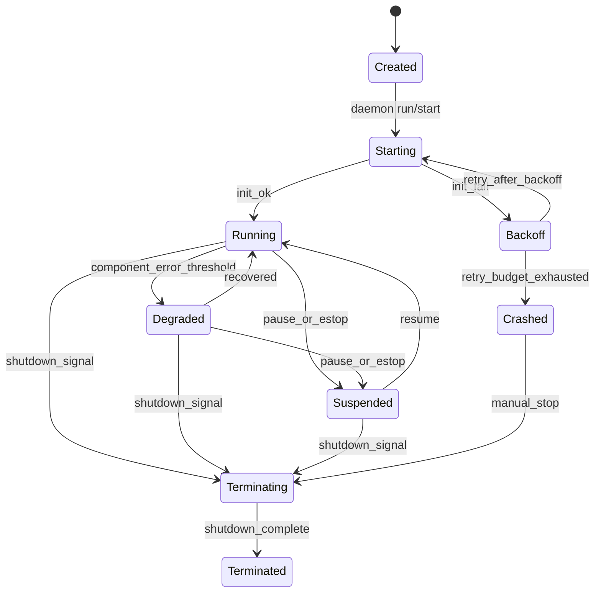

# F1-3 Agent Lifecycle State Machine RFI (2026-03-01)

Status: RFI complete, implementation planning ready.
GitHub issue: [#2308](https://github.com/zeroclaw-labs/zeroclaw/issues/2308)
Linear: [RMN-256](https://linear.app/zeroclawlabs/issue/RMN-256/rfi-f1-3-agent-lifecycle-state-machine)

## Summary

ZeroClaw currently has strong component supervision and health snapshots, but it does not expose a
formal agent lifecycle state model. This RFI defines a lifecycle FSM, transition contract,
synchronization model, persistence posture, and migration path that can be implemented without
changing existing daemon reliability behavior.

## Current-State Findings

### Existing behavior that already works

- `src/daemon/mod.rs` supervises gateway/channels/heartbeat/scheduler with restart backoff.
- `src/health/mod.rs` tracks per-component `status`, `last_ok`, `last_error`, and `restart_count`.
- `src/agent/session.rs` persists conversational history with memory/SQLite backends and TTL cleanup.
- `src/agent/loop_.rs` and `src/agent/agent.rs` provide bounded per-turn execution loops.

### Gaps blocking lifecycle consistency

- No typed lifecycle enum for the agent runtime (or per-session runtime state).
- No validated transition guard rails (invalid transitions are not prevented centrally).
- Health state and lifecycle state are conflated (`ok`/`error` are not full lifecycle semantics).
- Persistence only covers health snapshots and conversation history, not lifecycle transitions.
- No single integration contract for daemon, channels, supervisor, and health endpoint consumers.

## Proposed Lifecycle Model

### State definitions

- `Created`: runtime object exists but not started.
- `Starting`: dependencies are being initialized.
- `Running`: normal operation, accepting and processing work.
- `Degraded`: still running but with elevated failure/restart signals.
- `Suspended`: intentionally paused (manual pause, e-stop, or maintenance gate).
- `Backoff`: recovering after crash/error; restart cooldown active.
- `Terminating`: graceful shutdown in progress.
- `Terminated`: clean shutdown completed.
- `Crashed`: unrecoverable failure after retry budget is exhausted.

### State diagram



### Transition table

| From | Trigger | Guard | To | Action |
|---|---|---|---|---|
| `Created` | daemon start | config valid | `Starting` | emit lifecycle event |
| `Starting` | init success | all required components healthy | `Running` | clear restart streak |
| `Starting` | init failure | retry budget available | `Backoff` | increment restart streak |
| `Running` | component errors | restart streak >= threshold | `Degraded` | set degraded cause |
| `Degraded` | recovery success | error window clears | `Running` | clear degraded cause |
| `Running`/`Degraded` | pause/e-stop | operator or policy signal | `Suspended` | stop intake/execution |
| `Suspended` | resume | policy allows | `Running` | re-enable intake |
| `Backoff` | retry timer | retry budget available | `Starting` | start component init |
| `Backoff` | retry exhausted | no retries left | `Crashed` | emit terminal failure event |
| non-terminal states | shutdown | signal received | `Terminating` | drain and stop workers |
| `Terminating` | done | all workers stopped | `Terminated` | persist final snapshot |

## Implementation Approach

### State representation

Add a dedicated lifecycle type in runtime/daemon scope:

```rust
enum AgentLifecycleState {
    Created,
    Starting,
    Running,
    Degraded { cause: String },
    Suspended { reason: String },
    Backoff { retry_in_ms: u64, attempt: u32 },
    Terminating,
    Terminated,
    Crashed { reason: String },
}
```

### Synchronization model

- Use a single `LifecycleRegistry` (`Arc<RwLock<...>>`) owned by daemon runtime.
- Route all lifecycle writes through `transition(from, to, trigger)` with guard checks.
- Emit transition events from one place, then fan out to health snapshot and observability.
- Reject invalid transitions at runtime and log them as policy violations.

## Persistence Decision

Decision: **hybrid persistence**.

- Runtime source of truth: in-memory lifecycle registry for low-latency transitions.
- Durable checkpoint: persisted lifecycle snapshot alongside `daemon_state.json`.
- Optional append-only transition journal (`lifecycle_events.jsonl`) for audit and forensics.

Rationale:

- In-memory state keeps current daemon behavior fast and simple.
- Persistent checkpoint enables status restoration after restart and improves operator clarity.
- Event journal is valuable for post-incident analysis without changing runtime control flow.

## Integration Points

- `src/daemon/mod.rs`
  - wrap supervisor start/failure/backoff/shutdown with explicit lifecycle transitions.
- `src/health/mod.rs`
  - expose lifecycle state in health snapshot without replacing component-level health detail.
- `src/main.rs` (`status`, `restart`, e-stop surfaces)
  - render lifecycle state and transition reason in CLI output.
- `src/channels/mod.rs` and channel workers
  - gate message intake when lifecycle is `Suspended`, `Terminating`, `Crashed`, or `Terminated`.
- `src/agent/session.rs`
  - keep session history semantics unchanged; add optional link from session to runtime lifecycle id.

## Migration Plan

### Phase 1: Non-breaking state plumbing

- Add lifecycle enum/registry and default transitions in daemon startup/shutdown.
- Include lifecycle state in health JSON output.
- Keep existing component health fields unchanged.

### Phase 2: Supervisor transition wiring

- Convert supervisor restart/error signals into lifecycle transitions.
- Add backoff metadata (`attempt`, `retry_in_ms`) to lifecycle snapshots.

### Phase 3: Intake gating + operator controls

- Enforce channel/gateway intake gating by lifecycle state.
- Surface lifecycle controls and richer status output in CLI.

### Phase 4: Persistence + event journal

- Persist snapshot and optional JSONL transition events.
- Add recovery behavior for daemon restart from persisted snapshot.

## Verification and Testing Plan

### Unit tests

- transition guard tests for all valid/invalid state pairs.
- lifecycle-to-health serialization tests.
- persistence round-trip tests for snapshot and event journal.

### Integration tests

- daemon startup failure -> backoff -> recovery path.
- repeated failure -> `Crashed` transition.
- suspend/resume behavior for channel intake and scheduler activity.

### Chaos/failure tests

- component panic/exit simulation under supervisor.
- rapid restart storm protection and state consistency checks.

## Risks and Mitigations

| Risk | Impact | Mitigation |
|---|---|---|
| Overlap between health and lifecycle semantics | Operator confusion | Keep both domains explicit and documented |
| Invalid transition bugs during rollout | Runtime inconsistency | Central transition API with guard checks |
| Excessive persistence I/O | Throughput impact | snapshot throttling + async event writes |
| Channel behavior regressions on suspend | Message loss | add intake gating tests and dry-run mode |

## Implementation Readiness Checklist

- [x] State diagram and transition table documented.
- [x] State representation and synchronization approach selected.
- [x] Persistence strategy documented.
- [x] Integration points and migration plan documented.
