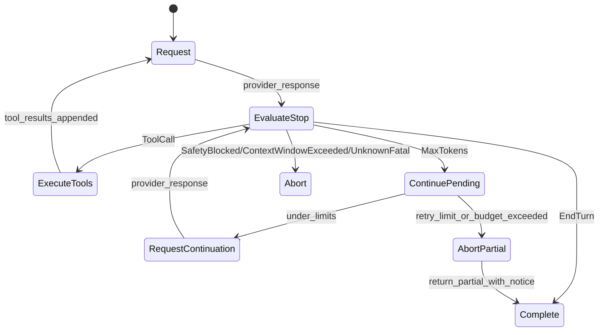

# Q0-3 Stop-Reason State Machine + Max-Tokens Continuation RFI (2026-03-01)

Status: RFI complete, implementation planning ready.
GitHub issue: [#2309](https://github.com/zeroclaw-labs/zeroclaw/issues/2309)
Linear: [RMN-257](https://linear.app/zeroclawlabs/issue/RMN-257/rfi-q0-3-stop-reason-state-machine-max-tokens-continuation)

## Summary

ZeroClaw currently parses text/tool calls and token usage across providers, but it does not carry a
normalized stop reason into `ChatResponse`, and there is no deterministic continuation loop for
`max_tokens` truncation. This RFI defines a provider mapping model, a continuation FSM, partial
tool-call recovery policy, and observability/testing requirements.

## Current-State Findings

### Confirmed implementation behavior

- `src/providers/traits.rs` `ChatResponse` has no stop-reason field.
- Provider adapters parse text/tool-calls/usage, but stop reason fields are mostly discarded.
- `src/agent/loop_.rs` finalizes response if no parsed tool calls are present.
- Existing parser in `src/agent/loop_/parsing.rs` already handles many malformed/truncated
  tool-call formats safely (no panic), but this is parsing recovery, not continuation policy.

### Known gap

- When a provider truncates output due to max token cap, the loop lacks a dedicated continuation
  path. Result: partial responses can be returned silently.

## Proposed Stop-Reason Model

### Normalized enum

```rust
enum NormalizedStopReason {
    EndTurn,
    ToolCall,
    MaxTokens,
    ContextWindowExceeded,
    SafetyBlocked,
    Cancelled,
    Unknown(String),
}
```

### `ChatResponse` extension

Add stop-reason payload to provider response contract:

```rust
pub struct ChatResponse {
    pub text: Option<String>,
    pub tool_calls: Vec<ToolCall>,
    pub usage: Option<TokenUsage>,
    pub reasoning_content: Option<String>,
    pub quota_metadata: Option<QuotaMetadata>,
    pub stop_reason: Option<NormalizedStopReason>,
    pub raw_stop_reason: Option<String>,
}
```

`raw_stop_reason` preserves provider-native values for diagnostics and future mapping updates.

## Provider Mapping Matrix

This table defines implementation targets for active provider families in ZeroClaw.

| Provider family | Native field | Native values | Normalized |
|---|---|---|---|
| OpenAI / OpenRouter / OpenAI-compatible chat | `finish_reason` | `stop` | `EndTurn` |
| OpenAI / OpenRouter / OpenAI-compatible chat | `finish_reason` | `tool_calls`, `function_call` | `ToolCall` |
| OpenAI / OpenRouter / OpenAI-compatible chat | `finish_reason` | `length` | `MaxTokens` |
| OpenAI / OpenRouter / OpenAI-compatible chat | `finish_reason` | `content_filter` | `SafetyBlocked` |
| Anthropic messages | `stop_reason` | `end_turn`, `stop_sequence` | `EndTurn` |
| Anthropic messages | `stop_reason` | `tool_use` | `ToolCall` |
| Anthropic messages | `stop_reason` | `max_tokens` | `MaxTokens` |
| Anthropic messages | `stop_reason` | `model_context_window_exceeded` | `ContextWindowExceeded` |
| Gemini generateContent | `finishReason` | `STOP` | `EndTurn` |
| Gemini generateContent | `finishReason` | `MAX_TOKENS` | `MaxTokens` |
| Gemini generateContent | `finishReason` | `SAFETY`, `RECITATION` | `SafetyBlocked` |
| Bedrock Converse | `stopReason` | `end_turn` | `EndTurn` |
| Bedrock Converse | `stopReason` | `tool_use` | `ToolCall` |
| Bedrock Converse | `stopReason` | `max_tokens` | `MaxTokens` |
| Bedrock Converse | `stopReason` | `guardrail_intervened` | `SafetyBlocked` |

Notes:

- Unknown values map to `Unknown(raw)` and must be logged once per provider/model combination.
- Mapping must be unit-tested against fixture payloads for each provider adapter.

## Continuation State Machine

### Goals

- Continue only when stop reason indicates output truncation.
- Bound retries and total output growth.
- Preserve tool-call correctness (never execute partial JSON).

### State diagram



### Hard limits (defaults)

- `max_continuations_per_turn = 3`
- `max_total_completion_tokens_per_turn = 4 * initial_max_tokens` (configurable)
- `max_total_output_chars_per_turn = 120_000` (safety cap)

## Partial Tool-Call JSON Policy

### Rules

- Never execute tool calls when parsed payload is incomplete/ambiguous.
- If `MaxTokens` and parser detects malformed/partial tool-call body:
  - request deterministic re-emission of the tool call payload only.
  - keep attempt budget separate (`max_tool_repair_attempts = 1`).
- If repair fails, degrade safely:
  - return a partial response with explicit truncation notice.
  - emit structured event for operator diagnosis.

### Recovery prompt contract

Use a strict system-side continuation hint:

```text
Previous response was truncated by token limit.
Continue exactly from where you left off.
If you intended a tool call, emit one complete tool call payload only.
Do not repeat already-sent text.
```

## Observability Requirements

Emit structured events per turn:

- `stop_reason_observed`
  - provider, model, normalized reason, raw reason, turn id, iteration.
- `continuation_attempt`
  - attempt index, cumulative output tokens/chars, budget remaining.
- `continuation_terminated`
  - terminal reason (`completed`, `retry_limit`, `budget_exhausted`, `safety_blocked`).
- `tool_payload_repair`
  - parse issue type, repair attempted, repair success/failure.

Metrics:

- counter: continuations triggered by provider/model.
- counter: truncation exits without continuation (guardrail/budget cases).
- histogram: continuation attempts per turn.
- histogram: end-to-end turn latency for continued turns.

## Implementation Outline

### Provider layer

- Parse and map native stop reason fields in each adapter.
- Populate `stop_reason` and `raw_stop_reason` in `ChatResponse`.
- Add fixture-based unit tests for mapping.

### Agent loop layer

- Introduce `ContinuationController` in `src/agent/loop_.rs`.
- Route `MaxTokens` through continuation FSM before finalization.
- Merge continuation text chunks into one coherent assistant response.
- Keep existing tool parsing and loop-detection guards intact.

### Config layer

Add config keys under `agent`:

- `continuation_max_attempts`
- `continuation_max_output_chars`
- `continuation_max_total_completion_tokens`
- `continuation_tool_repair_attempts`

## Verification and Testing Plan

### Unit tests

- stop-reason mapping tests per provider adapter.
- continuation FSM transition tests (all terminal paths).
- budget cap tests and retry-limit behavior.

### Integration tests

- mock provider returns `MaxTokens` then successful continuation.
- mock provider returns repeated `MaxTokens` until retry cap.
- mock provider emits partial tool-call JSON then repaired payload.

### Regression tests

- ensure non-truncated normal responses are unchanged.
- ensure existing parser recovery tests in `loop_/parsing.rs` remain green.
- verify no duplicate text when continuation merges.

## Risks and Mitigations

| Risk | Impact | Mitigation |
|---|---|---|
| Provider mapping drift | incorrect continuation triggers | keep `raw_stop_reason` + tests |
| Continuation repetition loops | poor UX, extra tokens | dedupe heuristics + strict caps |
| Partial tool-call execution | unsafe tool behavior | hard block on malformed payload |
| Latency growth | slower responses | cap attempts and emit metrics |

## Implementation Readiness Checklist

- [x] Provider stop-reason mapping documented.
- [x] Continuation policy and hard limits documented.
- [x] Partial tool-call handling strategy documented.
- [x] Proposed state machine documented for implementation.
